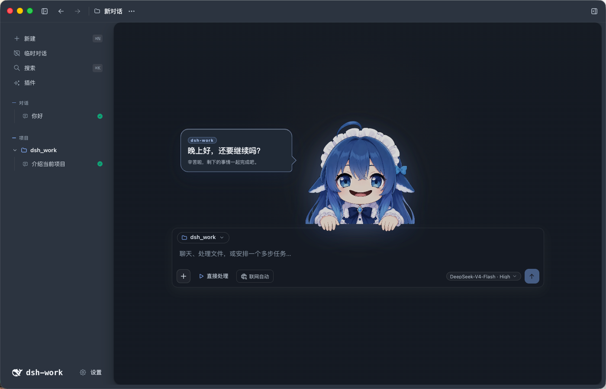
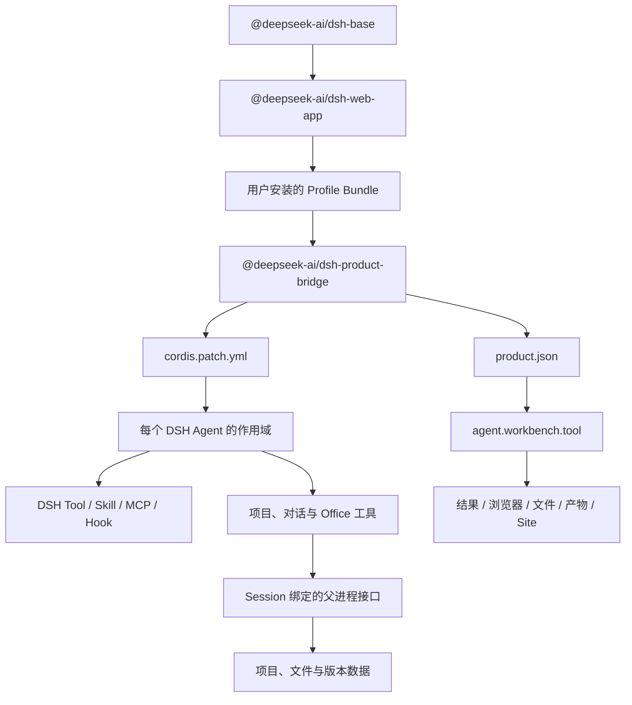
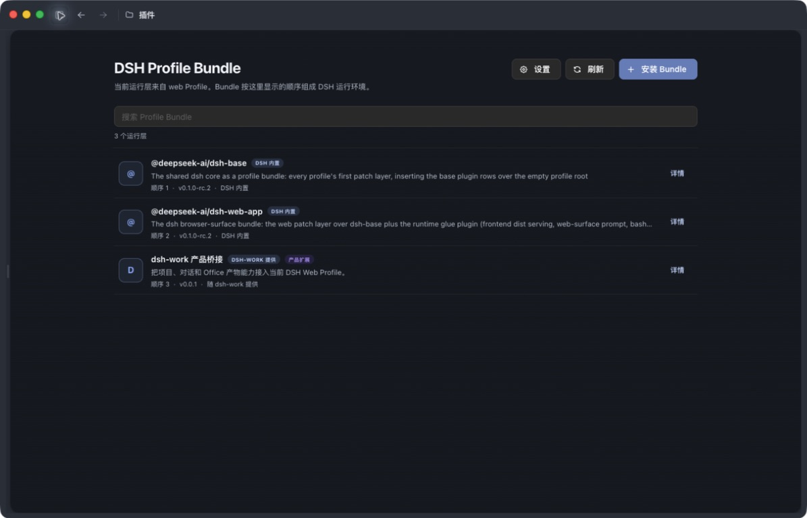
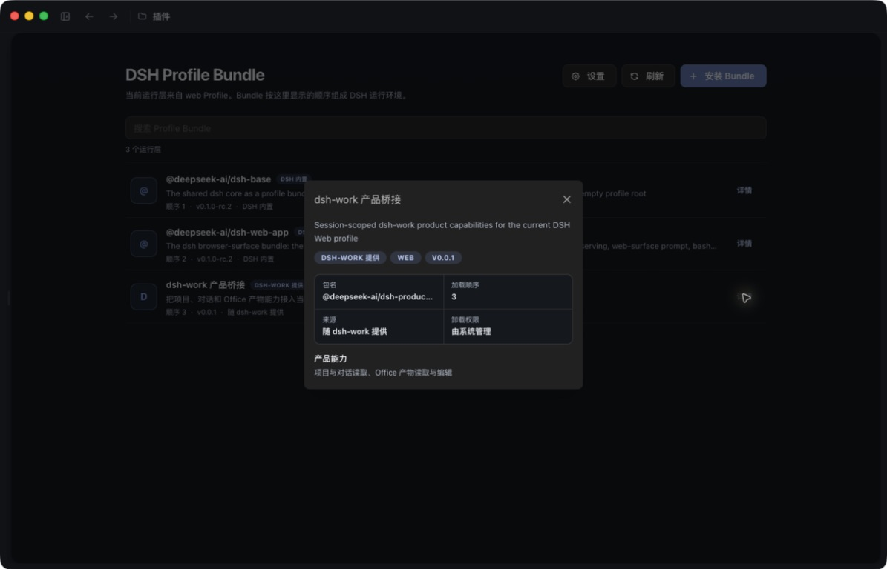
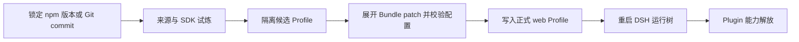

# dsh-work

English | [中文](README.md)

> Takes on WorkBuddy, kicks Codex.
>
> Join us to unleash the power of Plugin and turn every good idea into work that changes the world.

A local AI work desktop with an anime-inspired exterior and a serious drive to carry every task through.

dsh-work brings DSH Plugin fully to life on the desktop. Install a Bundle, shape a Profile, and send projects, files, web pages, and Agents into battle together.



_The guide character rallies the team; DSH Session carries each task to the finish. The screenshot comes from a real Electron window and contains no user project or session data._

> The product is still in private beta. Interfaces, Bundle contracts, and installation methods may continue to evolve; this does not represent a public release.

## Capability List

The guide character is only the cover. Once the app starts, every capability layer must light up in DSH's official runtime tree.

| Battleground | Available capabilities | Power source |
|---|---|---|
| Session battleground | Streaming responses, plans, tool calls, queues, in-run additions, stop, resume, and history | DSH Session and Agent Plugin |
| Local base | Projects, multiple local directories, file browsing, previews, filename search, and full-text search | dsh-work product layer |
| Multi-Agent operations | Assign independent subtasks to sub-Agents and summarize them in the main session | DSH Subagent and Workflow Plugin |
| Office artifact forge | Read, create, and surgically edit Markdown, DOCX, XLSX, PPTX, and PDF; each save creates a new version | `dsh-product-bridge` |
| Right tactical panel | Results and evidence, browser, files, artifacts, and Site pages | `agent.workbench.tool` product position |
| Capability extension slots | Add capabilities through Profile Bundle, Skill, MCP, Hook, and Web Slot | DSH Web Profile |
| Protective boundary | Session binds project identity, writes go through DSH approval, and credentials never enter the Renderer or Bundle configuration | DSH permission layer and dsh-work parent process |


_This is more than character art and slogans: a real project session shows the Agent response, file changes, workspace permissions, and model selection together._

## World Rule: Everything Is a Plugin

DSH's official core premise is simple: **Everything is a Plugin**. Models, tools, policies, storage, context management, and interfaces can all be Cordis Plugins, and even the Agent loop belongs to this system.

So the thing that truly unlocks capabilities is **Plugin**, not Profile:

- **Plugin is a move**: it registers model, tool, Skill, MCP, policy, storage, or interface capabilities.
- **Bundle is a reinforcement pack**: it carries `cordis.patch.yml` and installs a group of Plugins into DSH.
- **Profile is the battle formation**: it layers multiple Bundle patch layers in order and decides which capabilities this startup includes.

dsh-work does not maintain a second Plugin universe. Installation state, load order, and runtime state all come from the DSH `web` Profile.



This chain follows four basic rules:

1. **Profile is the single authority**: Profile's exact dependencies represent what is installed, and `dsh.profile.bundles` represents the load order.
2. **Bundle is the installation unit**: the package must declare `package.json#dsh.bundle.patch`, and the patch adds the Plugin to the Cordis runtime tree.
3. **Capabilities enter official interfaces**: model capabilities enter a Tool, Skill, MCP, Hook, or Cordis service; browser interfaces enter a DSH Web Slot.
4. **Product data is authorized by Session**: the Bundle sends only the DSH Session id, and the dsh-work parent process resolves the current user, project, and permissions.



_Plugin Center is the formation screen: you can see at a glance which Bundles the current `web` Profile carries and which one enters first._

## Dedicated Summon: dsh-work Product Bridge

The [`@deepseek-ai/dsh-product-bridge`](packages/dsh-product-bridge/README.md) shipped with the app is dsh-work's dedicated Bundle. It does not alter the Agent loop or read across the product database boundary; it provides support only through DSH's official interfaces.

It opens two support lines at once:

- `cordis.patch.yml` registers `project_list`, `conversation_list`, and three `artifact_office_*` tools in every Agent's scope.
- `product.json` places the results, browser, files, artifacts, and Site pages in dsh-work's `agent.workbench.tool` product position.

Office creation and editing are advanced write capabilities and first trigger DSH approval. Editing must read stable anchors and the current version; every save forges a new immutable version, while older versions remain available.



_The Product Bridge's name, order, and capabilities all come from the same Profile; there is no second Plugin list hidden behind the app._

## How a New Teammate Joins

A new Bundle cannot join the team by merely downloading a repository and declaring success. Ordinary users install a fixed version from Plugin Center, then face three trials: a candidate Profile, configuration expansion, and a real startup.



During Plugin development, use the DSH CLI to inspect the final formation. Profile is the pnpm workspace root, so the summon command needs `-w`:

```bash
# 固定 npm 版本
dsh plugin --profile web add -w @scope/dsh-example@1.2.3

# 固定 Git commit
dsh plugin --profile web add -w github:<owner>/<repo>#<40位commit>

# 启动前确认最终组合
dsh --profile web --dump-config
```

The minimum declaration for a Plugin package is:

```json
{
  "name": "@deepseek-ai/dsh-example",
  "dsh": {
    "bundle": {
      "patch": "./cordis.patch.yml"
    }
  }
}
```

To extend the DSH browser interface, use the nested `dsh.client` manifest and the official Web Slot. To enter the dsh-work product workbench, use an approved `dshWork.product` description; user-installed JSON cannot directly execute arbitrary Electron components.

## Summon the Development Build

Prepare Node.js 24 or later, then summon the development build. The current development build uses the sibling DSH source runtime; Plugin development uses only the official NPM SDK, and TypeScript configuration must not reach into the DSH source.

```bash
cd /path/to/dsh-work

export DSH_RUNTIME_DISTRIBUTION=source
export DSH_SOURCE_ROOT=/absolute/path/to/dsh-source

npm install
npm run doctor
npm run dev
```

Root commands select the Node.js version that matches the architecture of the native dependencies on the machine. After switching the Node.js major version, CPU architecture, or operating system, run this again:

```bash
npm run setup
```

Common checks:

```bash
npm run typecheck
npm run test:renderer
npm run test:unit
npm run eval:pr
npm run eval:ui
```

The final trial must be completed in real Electron. Opening only the Renderer URL shows a projection; it does not prove that IPC, DSH subprocesses, system permissions, and local-file capabilities are working.

## Runtime Composition

```text
dsh-work Renderer
  -> Electron IPC
  -> dsh-work server
  -> DSH RC2 Web Profile
  -> Cordis Plugin tree
  -> Session / Agent / Tool / Skill / MCP / Slot
```

| Directory | Purpose |
|---|---|
| `electron/` | Desktop windows, inter-process communication, and packaging |
| `renderer/` | React desktop interface |
| `server/` | Project data, product permissions, DSH process management, and Session binding |
| `packages/` | DSH Profile Bundles shipped with the app |
| `eval/` | Unit tests, contract tests, and real Electron evaluation |
| `docs/images/readme/` | Real runtime and capability images used by the README |

During development, DSH Web listens only on a local `127.0.0.1` port. Formal installers use inter-process communication and do not expose the product service to the local network.

## Barriers and Restricted Zones: Data Security

Local data is stored by default under `~/.dsh`, including projects, sessions, run records, artifact versions, and local Trace. Back up before lifting the seal.

- Never commit API keys, database passwords, private addresses, real business data, or local databases to Git.
- The Source directory is read-only by default; when an Agent needs to modify files, explicitly set the writable directory.
- A Bundle cannot use browser parameters to select another user, another project, or another credential set.
- Models, MCP, OAuth, and remote services remain subject to their respective network and account boundaries.

See [PRIVACY.md](PRIVACY.md), [SECURITY.md](SECURITY.md), and [third-party component notices](THIRD_PARTY_NOTICES.md) for the complete rules.

## Current Status

The current version remains in local, single-machine beta. The DSH Session main chain, Profile composition, Product Bridge, workbench contributions, and core Electron conversation flow already have automated tests and real desktop evidence. External Bundles still need SDK adaptation, candidate installation, startup, uninstall, and residue checks one by one; real OAuth, website login, long-running tasks, and different model capabilities also require continued acceptance in their respective areas.

## Supported Platforms

| Platform | Current status |
|---|---|
| macOS Apple Silicon | Development and directory packages verified |
| macOS Intel | Rosetta checks passed; Intel hardware acceptance is still required |
| Windows x64 | Connected to the build flow; real-machine acceptance of the installer is still required |
| Windows arm64 | Not supported yet |
| Linux | No desktop packaging configuration yet |

Unsigned artifacts are written to `release/`. Before formal release, macOS signing and notarization, Windows code signing, real-machine installer checks, and confirmation of distribution licenses are still required.

## License

The project code uses the [MIT License](LICENSE). Licenses, origins, and distribution restrictions for third-party dependencies and binary files are listed in [THIRD_PARTY_NOTICES.md](THIRD_PARTY_NOTICES.md).
