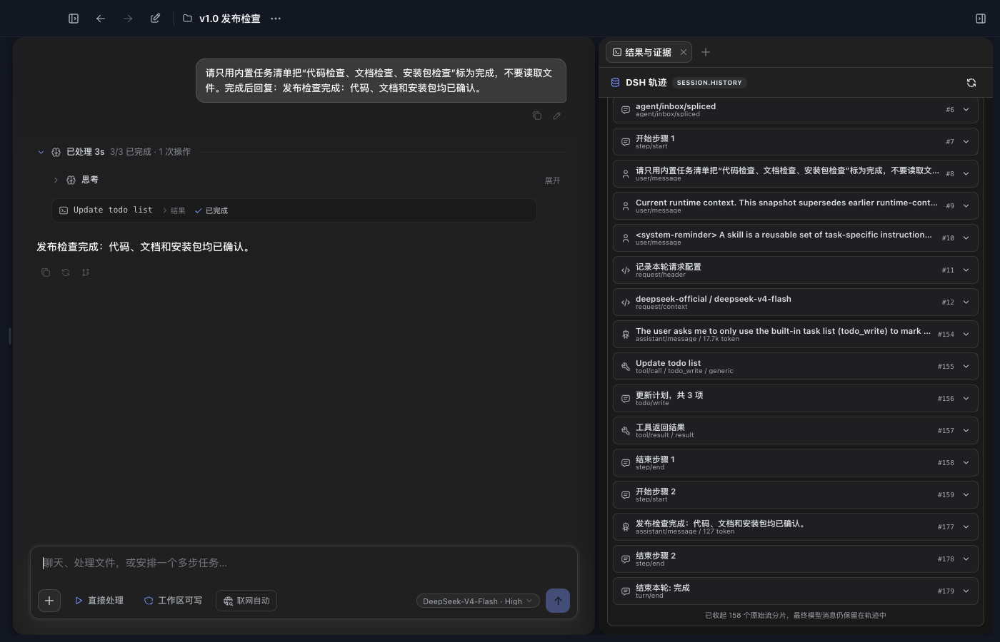
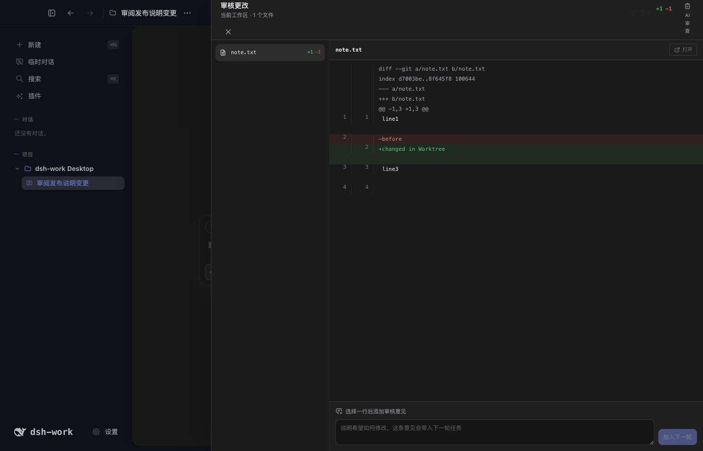

# dsh-work

[中文](README.md) | English

dsh-work is a local AI work desktop built on DeepSeek Harness (DSH). It turns DSH Session, Agent, Tool, Skill, MCP, Profile Bundle, and Web Client capabilities into a desktop product for projects, files, web pages, and durable artifacts.

The project is currently in private beta and is not a public release.


## Quick start

Local development requires Node.js 24 or later. The current code pins the public DSH `0.1.0-rc.6` release line, and the official SDK does not require `NPM_TOKEN`.

```bash
npm install
npm run doctor
npm run dev
```

Prepare dependencies again after changing the Node.js major version, CPU architecture, or operating system:

```bash
npm run setup
```

Final acceptance must use real Electron. A standalone Renderer page does not prove DSH subprocess, IPC, system-permission, local-file, or native-module behavior.

## Feature map and integration status

“Using the official DSH Web” does not mean embedding its pages unchanged in Electron. dsh-work keeps the official Web Profile's Session, Agent, Tool, Skill, MCP, Client Loader, and Slot graph, then replaces the visible layout, sidebar, conversation, and general-settings pages with its desktop shell. Features fall into three groups:

- **DSH native**: the official DSH services and Session Log own execution and state.
- **Formally bridged to DSH**: dsh-work owns the product data, but exposes it through a Profile Bundle, Agent Tool, bound Session, or Slot contract in the same DSH runtime path.
- **Desktop product capability**: Electron or the dsh-work product layer owns it. It is not presented as a native DSH feature; selected pages, files, directories, or artifacts are handed to the current DSH Session only when needed.

### Native DSH capabilities

| Feature | What users can do | Integration and authority |
|---|---|---|
| Conversation and recovery | Stream answers and reasoning, inspect tool cards, stop, continue, and recover after restart | One product conversation binds to one DSH Session; `session.history` is authoritative |
| In-run control | Queue a message, steer a running turn, and inspect waiting state | DSH Agent queue and Session events; there is no second product queue |
| Models and reasoning | Select provider, model, reasoning effort, and credential references | DSH Settings, Credentials, and model catalog; the UI never reads plaintext secrets |
| Permissions, approvals, questions, plans, and todos | Change Session permissions, answer tool approvals and model questions, follow Plan/todo progress, and run `/compact` | DSH commands, interaction protocol, projections, and `todo/write` events; approval rules can be remembered for one action, the Session, or longer |
| Tool, Skill, MCP, and Hook | Use capabilities loaded by the active Profile | DSH Web Profile Host tree and Agent-scoped registries |
| Multi-Agent | Delegate subtasks, inspect sub-Agent tool events in the conversation and trajectory, wait, and summarize into the parent | DSH Subagent and Workflow; a child pins the model target resolved by its parent; the official standalone sub-Agent management UI is not mapped |
| Images and web results | Paste or choose images, use DSH web tools, and recover web source cards | DSH content-addressed attachments, ToolEventView, and Session Log |
| Results and evidence | Inspect per-turn events, tool input/output, duration, tokens, and final answer | Reads only DSH `session.history`; `/runs` and `/trace` open the same authoritative trajectory |

### Product capabilities formally bridged to DSH

| Feature | What users can do | Integration path |
|---|---|---|
| App/project context and memory | Configure app and project instructions, temporary-chat boundaries, and global/project memory | `dsh-product-bridge` injects immutable `agent/pre-step` messages and logs `dsh-work-context` / `dsh-work-memory` provenance |
| Project and conversation lookup | Ask the model to list the current user's projects and conversations in the bound project | Agent-scoped `project_list` and `conversation_list`; the parent owns user and project identity |
| Git Worktrees | Create, activate, deactivate, and remove isolated work directories; run new conversations there | The product layer owns Git lifecycle and supplies the active path as the new DSH Session `cwd`; Diff and line edits use the same root |
| Canvas and local Site | Let the model inspect, create, or edit a Canvas, produce exact inline suggestions, and create or update single-file Sites | `canvas_inspect/create/edit/suggest` are DSH Tools; writes require DSH approval and result events open the workspace |
| Office artifacts | Inspect, create, and anchor-edit Markdown, DOCX, XLSX, PPTX, and PDF with immutable versions | `artifact_office_inspect/create/edit` are DSH Tools restricted by the parent to the bound project and Session |
| Structured UI | Let the model produce layouts, text, metrics, tables, charts, images, buttons, and forms inside an answer | `ui_render` is a DSH Tool; the parent validates the complete document and stores it in the Session Log, while button and form actions return as the next visible user message |
| Right-side workbench | Add, switch, collapse, and close Results, Browser, Files, Artifacts, and Site tabs | The Profile contributes a trusted roster through the app-owned `agent.workbench.tool` position, reusing DSH SlotCore underneath |
| App-shipped UI and theme Bundles | Use settings extensions, overlays, sidebar actions, composer docks, and restricted theme tokens | Reviewed Client Bundles shipped with the App join the same DSH Client graph; new user `dsh.client` candidates are blocked and older installations are removed from the active graph |

### dsh-work desktop product capabilities

| Feature | What users can do | Handoff to DSH |
|---|---|---|
| Desktop shell and navigation | Use a three-column workbench, collapse either side, move back or forward, create a conversation, search globally, use zoom shortcuts, and check for App updates | Electron and product routing own the shell; the bound DSH Session still supplies conversation state |
| Projects and source roots | Create, rename, reorder, pin, and archive projects; maintain multiple authorized source directories, reveal them in Finder, and select the Agent write target | The product database owns organization and authorization; a new DSH Session receives the active working directory, while project memory stays scoped to that project |
| Conversation organization | Create project, global, or temporary conversations; pin, reorder, rename, archive, restore, and remove | Conversations bind DSH Sessions; cross-project move is explicitly disabled because DSH does not support it |
| Input and references | Reference project files with `@`, other conversations with `#`, paste images, and convert large pasted text into a TXT attachment | References and attachments enter the current DSH request; a temporary conversation is cleaned up on exit and does not enter normal history |
| Message actions | Copy an answer, or edit/retry from a user message or answer to create a branch | A branch creates a new product conversation and DSH Session; the original remains unchanged |
| Coding workspace | Inspect the current Diff, comment or edit by line, open a file in an external editor, start AI Review, and safely revert model-made file changes | Diff, edit, and revert stay pinned to the Session's creation-time `cwd`; content hashes reject stale actions; stage, commit, and push are not provided |
| Files workspace | Browse Source, task, and artifact roots; preview text, code, images, and extracted Office content; search names or contents; open or reveal files; and publish them as artifacts | The file tree is product UI; references enter chat, while Agent reads and writes still use the DSH `cwd`, file tools, and permissions |
| Browser Workspace | Use up to 12 tabs with navigation, history, find-in-page, zoom, downloads, print, developer tools, site permissions, storage clearing, page snapshots, and “Use this page” | Electron WebContentsView owns the page; page text and screenshots can enter the current DSH Session, but this does not replace DSH web tools |
| Global search | Search and filter projects, conversations, files, artifacts, and saved web sources | Results open product surfaces and can be added to the current conversation when model work is needed |
| Artifact library and Office editors | Search, filter, preview, compare, and restore versions; publish local files; select Office content; and insert structured references | Manual management stays in the product layer; model-driven Office writes use the DSH Tool bridge above |
| Canvas workspace | Inspect versions, edit content, compare changes, accept or reject inline suggestions, and handle version conflicts | The product layer stores immutable versions; model reads and writes use the Canvas DSH Tools above |
| Local Site workspace | Preview desktop/tablet/mobile layouts, select DOM and ask DSH, inspect versions, and export a single-file page | The page runs in an isolated preview sandbox; model writes use Canvas/Site DSH Tools, and no deployment service is present |
| Themes and appearance | Switch between Profile-provided professional and anime themes, choose light/dark mode, and adjust personal background and transparency | Profile data supplies theme tokens and the product appearance Store persists the user's choice; local theme creation and import are disabled in normal builds |
| Desktop settings | Language, zoom, appearance, terminal font, proxy, certificates, timeout, web-search mode, notifications, sound, drafts, and display choices | App settings belong to Electron; models, credentials, permissions, and Profile settings remain DSH-owned |
| Public share viewer | Open read-only shared content at `/share/:token` | Only the viewer route exists; creation, management, and revocation UI is not mounted |
| Onboarding and privacy | Local setup, data-location guidance, and privacy choices | The product layer owns local UX without changing DSH credential or network boundaries |

## The DSH trajectory is the result and evidence

The right-side “Results and evidence” view does not maintain a second run center. It reads only the bound DSH Session's `session.history`, keeping user messages, request context, model output, tool calls, tool results, permission changes, projections, and the final answer in one replayable trajectory. Ordinary conversation history can fall back to a local product projection marked `dsh_degraded` if DSH history cannot be read, but Results and evidence never presents that projection as a DSH trajectory.


This GIF was recorded in real Electron with the current DSH Profile, configured model, and a real `todo_write` call. The capture script verifies `session.history` as the trajectory source and removes its temporary project and Session afterward.



The panel aggregates and hides high-frequency `assistant/chunk` stream fragments while retaining final model messages, tool calls, and tool results. Every retained event can reveal its original DSH HistoryEntry, without mixing in a legacy run center or another Trace product.

## Conversation and workbench

One project conversation maps to one DSH Session. The current Profile Bundles can contribute Results and evidence, browser, files, artifacts, and Site tabs to the right-side workbench. Agent execution, the DSH working directory, the current Diff, and line editing follow the current project and active Worktree. The project file tree and file references continue to show the authorized source roots configured for the project, so switching Worktrees does not silently replace the directory the user is browsing.


### Canvas and Site workspace evidence

These screenshots come from their real Electron smokes. The Canvas image is captured after create, edit, inline suggestion, restore, and both concurrent-conflict branches, showing the local draft preserved as v7. The Site image is captured after create, interaction, DOM selection, source editing, restore, export, and App-restart recovery.


## Isolated development with Git Worktrees

Git Worktrees in project settings are a complete isolated-development workflow rather than a read-only status view:

1. Create a separate branch and `.dsh-worktrees/<id>` working directory under the project's Git repository root. Enter a branch name or leave it blank to generate one.
2. A project can manage multiple Worktrees, with at most one active at a time. After activation, new conversations use that Worktree for Agent execution, the DSH Session, the current Diff, and line editing, while the main checkout remains unchanged. The project file tree still shows its configured authorized source roots.
3. Switch back to the main checkout at any time. An active Worktree cannot be removed until you switch back and confirm removal. Removing its working directory keeps the Git branch so commits are not deleted accidentally.
4. Project members can view Worktrees, while only the project owner can create, switch, or remove them. Non-Git directories, repository subdirectories, duplicate branches, out-of-scope paths, and symlinked management directories are rejected; a missing on-disk Worktree is marked unavailable.
5. If persistence fails after creation, the App removes the new Worktree and branch as compensation. If corrupted state marks more than one Worktree active, the App falls back to the main checkout, and the next explicit activation repairs the state.

A DSH Session pins its working directory when it is created. Activate the target Worktree before starting a conversation. Existing conversations never move silently to a different directory; create a new conversation after switching working directories.

The following GIF uses real Electron with a temporary local Git repository and does not call a model. The recording checks the UI, project API, Git Worktree, current Diff, and main-checkout files, then removes the temporary project.




## Exact relationship with the official DSH Web

Current project conversations execute only through the selected official DSH Web Profile's Session and Agent, and the App does not wrap the complete official Web UI in an iframe. The dsh-work Server still owns product data, authorization, history projection, runtime diagnostics, and a small set of non-project-conversation services; the `web` Profile remains authoritative for plugin installation and order. Electron starts the official npm `0.1.0-rc.6` Web Profile and keeps its Host services, Web API, Session, Agent, Tool, Skill, MCP, Client Loader, and Client plugin graph. `@deepseek-ai/dsh-work-shell` replaces the visible desktop shell inside the same Cordis Client Context.

```text
Electron main process
  -> official DSH Web Profile
     -> Host: Session / Agent / Tool / Skill / MCP / Settings / Web API
     -> Client Loader and one Client plugin graph
        -> dsh-work-shell: desktop layout, sidebar, conversation, general settings
        -> mapped official Slots and trusted UI shipped with the App
     -> dsh-product-bridge: bound context, memory, Canvas/Site, Office, and structured-UI tools
  -> dsh-work product services: projects, authorized roots, BrowserView, Worktrees, artifacts, and local settings
```

To keep one visible product interface, the current Profile patch disables the official `ui-layout`, `ui-sidebar`, `ui-conversation`, and `ui-settings-general` page rows, then supplies those surfaces through the dsh-work shell. This does not disable the underlying DSH services or create a second Session or Agent store.

For trusted Client Bundles shipped with the App, the current window maps `settings.section`, selected `settings.general.item` entries, the Profile-owned `settings.plugins.tab`, `shell.overlay`, `sidebar.footer.action`, and the read-only `conversation.composer.dock`; the model-settings page reuses the official DSH Models section. Interactive input/message Slots, the full `conversation.composer`, `conversation.session.header.actions`, and the official sub-Agent pages are unsupported; `details` is present only to satisfy dependencies. Full `sidebar`, `conversation`, or `details` replacements are not rendered in the dsh-work window.

The integration follows four rules:

1. DSH owns Session messages, runs, plans, queues, permissions, tool events, and history.
2. Profile dependencies and `dsh.profile.bundles` are the only authority for plugin installation and order.
3. Product capabilities enter through a bound Session, DSH Tool, Client Plugin, or explicit Slot; they do not modify DSH source or maintain parallel runtime state.
4. dsh-work owns project data, file authorization, BrowserView, Worktrees, and artifact versions. Only model-facing parts cross the narrow bridge into DSH.


## Use other plugins

dsh-work installs DSH Profile Bundles. Regular users should install them from the “Plugins” page in the left navigation. That path uses the App's current `DSH_HOME` and `web` Profile, avoiding accidental installation into another DSH environment.

### Install from Plugin Center

1. Open “Plugins” and select “Install Bundle”.
2. Enter an immutable source. An npm package needs an exact version such as `@example/dsh-tools@1.2.3`. A repository under [dsh-external](https://github.com/dsh-external) needs a full 40-character commit, such as `github:dsh-external/DSH-better-sidebar#<40-character-commit>`.
3. Select “Check compatibility”. dsh-work installs the source in an isolated candidate Profile and checks the Bundle manifest, current DSH SDK, browser artifacts, and final composed configuration.
4. “Install into current Profile” becomes available only when the result is “Ready”. DSH restarts after installation, and the Bundle order appears in the plugin list.
5. Open Bundle details to confirm its source, version, order, and browser surface. User-installed Bundles can be removed from the list; DSH system Bundles and Bundles shipped with dsh-work cannot.

Plugin Center rejects `latest`, branch names, ordinary GitHub page URLs, and npm packages without exact versions. Installation uses `--ignore-scripts` and does not run build scripts from community repositories. Plugin authors must include the runtime entry and the browser artifact referenced by `exports["./client"]` in the package or pinned commit.

Local Bundle directories are for development only. Start the App with `DSH_PROFILE_ALLOW_LOCAL_PLUGINS=1`, then enter the absolute directory containing `package.json` in the install field. Regular users should not use this path.

### What appears after installation

| Plugin type | Current result |
|---|---|
| Tool, Skill, MCP, Hook, or Host service | Enters the DSH Host tree and may have no page; verify it through its capability and Session events |
| User-installed `dsh.client` UI | New candidates are blocked by `DSH_PROFILE_CLIENT_ISOLATION_REQUIRED`; an older installation keeps its dependency record but is removed from the active Bundle graph before every boot, shown as quarantined in Plugin Center, and remains removable |
| Trusted Client Bundle shipped with the App | Can use mapped `settings.section`, `shell.overlay`, `sidebar.footer.action`, and read-only `conversation.composer.dock` positions; full sidebar, conversation, and details surfaces remain unmapped |
| Data-only theme Bundle | Can provide color and appearance tokens through the restricted `dshWork.themes` descriptor; arbitrary CSS is rejected, while community themes containing `dsh.client` code remain blocked |
| dsh-work workbench page | `agent.workbench.tool` currently accepts only trusted components shipped with the App; community Bundles cannot request arbitrary Electron components by JSON name |

Plugin Center is therefore open to community Host Bundles today. A candidate containing Client code cannot become “Ready”, and an older community Client Bundle cannot enter the main-window graph, until it can run in a renderer isolated from Electron APIs. Reviewed Client Bundles shipped with the App continue to work in the mapped positions above.

### Develop an installable Bundle

A minimal Host Bundle declares its patch in `package.json`, and `cordis.patch.yml` inserts the plugin row into the runtime tree:

```json
{
  "name": "@example/dsh-tools",
  "version": "1.2.3",
  "type": "module",
  "main": "./lib/index.js",
  "files": ["lib/index.js", "cordis.patch.yml"],
  "dsh": {
    "bundle": {
      "patch": "./cordis.patch.yml"
    }
  },
  "peerDependencies": {
    "@deepseek-ai/cordis": "^4.0.1",
    "@deepseek-ai/dsh-tools": "^0.1.0-rc.6"
  }
}
```

```yaml
- insert:
    - id: example-tools
      name: '@example/dsh-tools'
```

Development dependencies must come from the official npm SDK and stay on the current rc.6 release line. TypeScript configuration and package dependencies must not point to a local DSH source checkout. A third-party `dsh.client` Bundle can currently be developed and tested, but Plugin Center will not install it into the main window; it needs App-shipped review or the future isolated Client host.

See the App's [dsh-work shell Client Plugin](packages/dsh-work-shell/README.md), [theme Bundle](packages/dsh-theme-pack/README.md), and [product bridge Bundle](packages/dsh-product-bridge/README.md). UI capability requires a reviewed, isolated host contract and cannot bypass Profile, Slot, or Electron permission boundaries through direct component imports.

## Themes

The professional and anime themes come from the `@deepseek-ai/dsh-theme-pack` Profile Bundle rather than two App-owned built-in theme records.

- `professional-blue` is the default and does not show the anime home character.
- `anime-blue` is optional and keeps the clear blue palette and character presentation.
- The Renderer keeps one hidden safety foundation for startup and recovery only.

Theme source, order, and removal follow the Web Profile. `dshWork.themes` is a narrow dsh-work product descriptor for safe color and appearance tokens. It is not an official DSH field and does not create a second plugin lifecycle.

The product does not expose local theme import or creation. Users may still adjust personal background and transparency, while new visual themes must ship as Profile Bundles.

## Features not currently provided

The following capabilities must not be presented as shipped:

- The automation backend and scheduling contracts exist, but the five-column task board and scheduling page are not mounted in the current product shell. Users currently have DSH plans and todos inside conversations.
- There is no Git graph, commit timeline, or stage/unstage/discard panel; Worktrees, Diff, line editing, and guarded recovery are available.
- There is no standalone terminal page or complete official sub-Agent management page, child-session navigation, or header actions. Sub-Agent execution and tool events are visible in the current conversation and DSH trajectory.
- Local Sites have no deployment service. Public sharing has a read-only viewer route but no creation, management, or revocation UI.
- There is no mobile remote control, QR pairing, public tunnel, or SSH/SFTP/port forwarding.
- There is no interactive pet, progression system, or multi-skin marketplace. The current `professional-blue` and `anime-blue` themes are Profile Bundles, and the anime character is static home content.
- DSH Sessions cannot currently move across projects, so the move-conversation entry explicitly reports that it is unavailable. Branch, retry, and edit-message actions work normally.
- Token usage comes from the DSH trajectory; there is no live TPS, LLM latency, or cache-hit strip below the composer.

## Product bridge

[`@deepseek-ai/dsh-product-bridge`](packages/dsh-product-bridge/README.md) is an App-shipped Profile Bundle. It registers 10 project, conversation, Canvas/Site, Office artifact, and `ui_render` tools in the current Agent scope through DSH interfaces and contributes workbench pages to `agent.workbench.tool`.

The bridge passes only the DSH Session id. The parent process resolves users, projects, directory permissions, and credentials; the Renderer and Bundle configuration do not hold plaintext credentials.

The bridge injects allowed App instructions, project instructions, and memory at `agent/pre-step`, then logs them in the same Session Log with `dsh-work-context` or `dsh-work-memory` provenance. Before a sub-Agent starts, it pins the provider/model already resolved by the parent conversation so it does not inherit a startup default.

## Development checks

```bash
npm run typecheck
npm run test:renderer
npm run test:unit
npm run eval:pr
npm run eval:ui
```

Record the README trajectory media again with:

```bash
node eval/readme-media-capture.mjs
node eval/readme-worktree-media-capture.mjs
```

## Repository layout

| Directory | Purpose |
|---|---|
| `electron/` | Desktop windows, IPC, native capabilities, and packaging |
| `renderer/` | React product UI and Client Plugin build |
| `server/` | Product services, authorization, Profile management, and DSH process connection |
| `packages/` | App-shipped Profile Bundles and Client Plugins |
| `eval/` | Contract, runtime, and real Electron evaluation |
| `docs/` | Architecture reviews, plans, designs, and stage guardrails |

## Data and security

Local Profile, Session, project, run, and artifact data lives under `~/.dsh` by default.

- Do not commit API keys, passwords, private endpoints, real business data, or local databases.
- Local source directories are read-only by default; Agent writes require an explicitly authorized directory.
- A Bundle cannot select another user, project, or credential through browser parameters.
- Models, MCP, OAuth, and remote services remain subject to their own network and account boundaries.

See [PRIVACY.md](PRIVACY.md), [SECURITY.md](SECURITY.md), and [THIRD_PARTY_NOTICES.md](THIRD_PARTY_NOTICES.md) for the complete rules.

## Platform status

| Platform | Current status |
|---|---|
| macOS Apple Silicon | Development and directory packages verified |
| macOS Intel | Rosetta checks pass; Intel hardware acceptance remains |
| Windows x64 | Build path is present; installer acceptance remains |
| Windows arm64 | Unsupported |
| Linux | No desktop packaging configuration |

Unsigned artifacts are for internal testing only. Public distribution still requires macOS signing and notarization, Windows code signing, and installer checks on real hardware.

## License

Project code uses the [MIT License](LICENSE). Third-party origins, licenses, and distribution restrictions are listed in [THIRD_PARTY_NOTICES.md](THIRD_PARTY_NOTICES.md).
