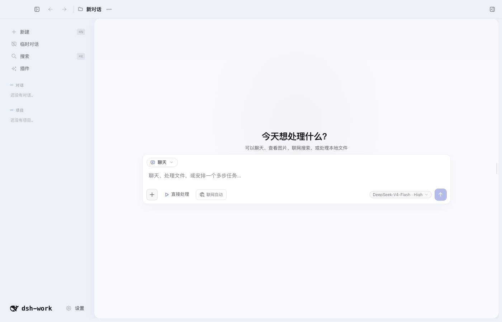
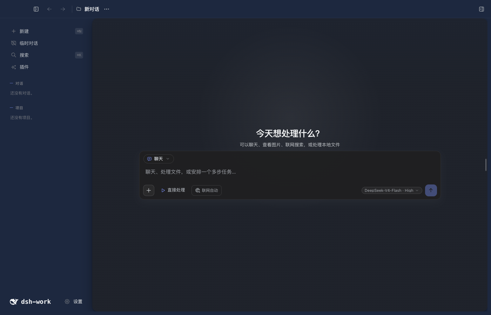
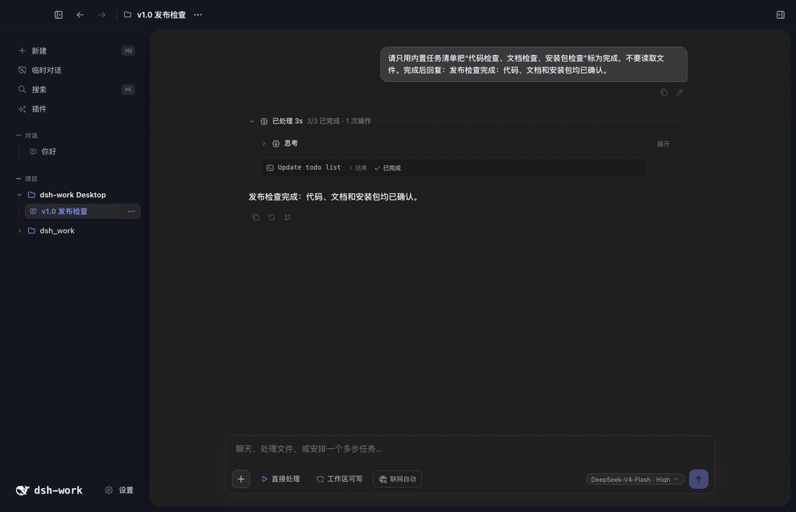
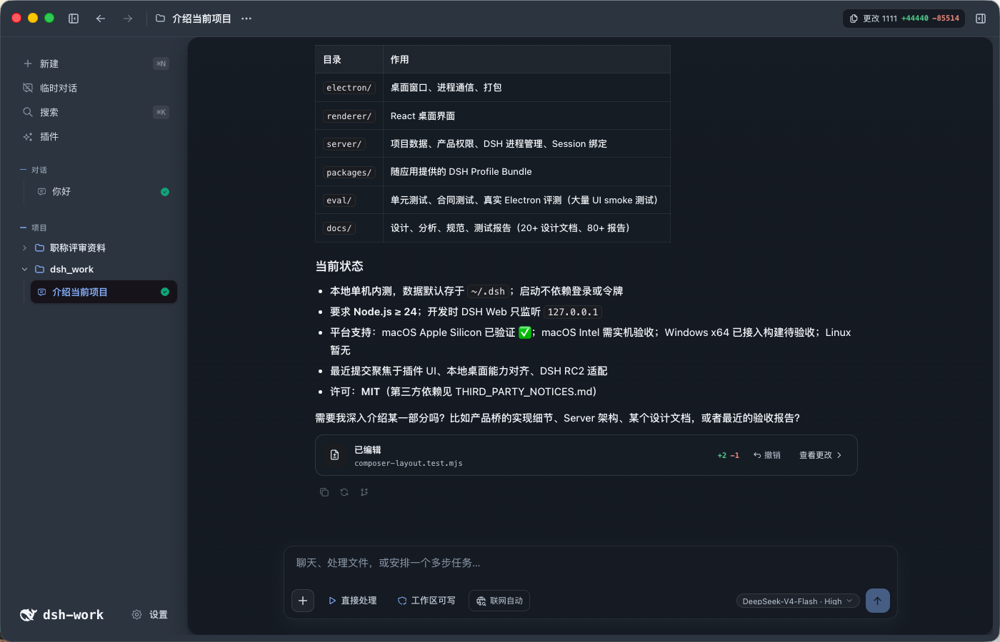
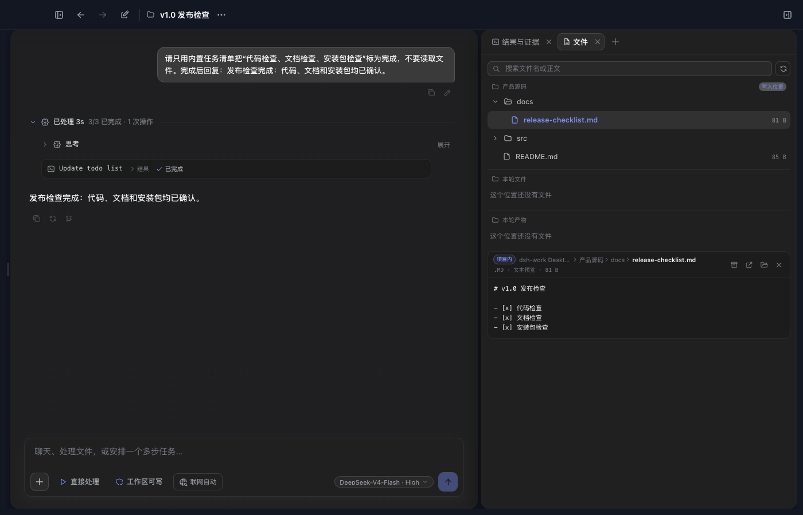
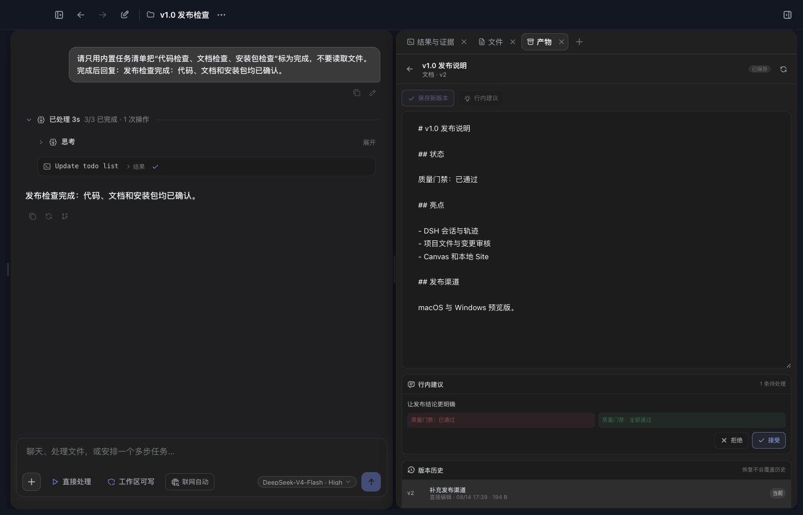
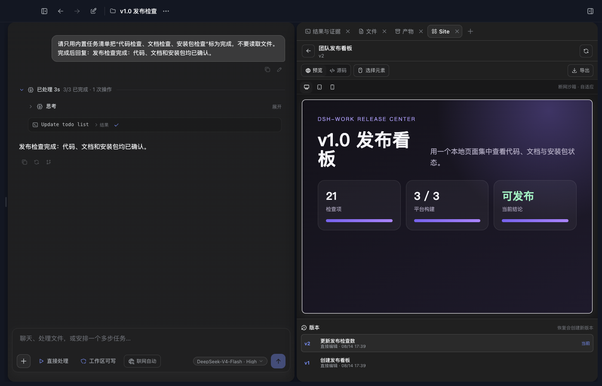
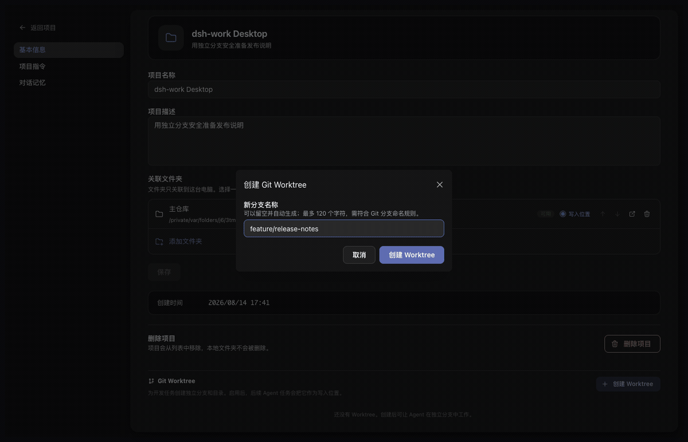
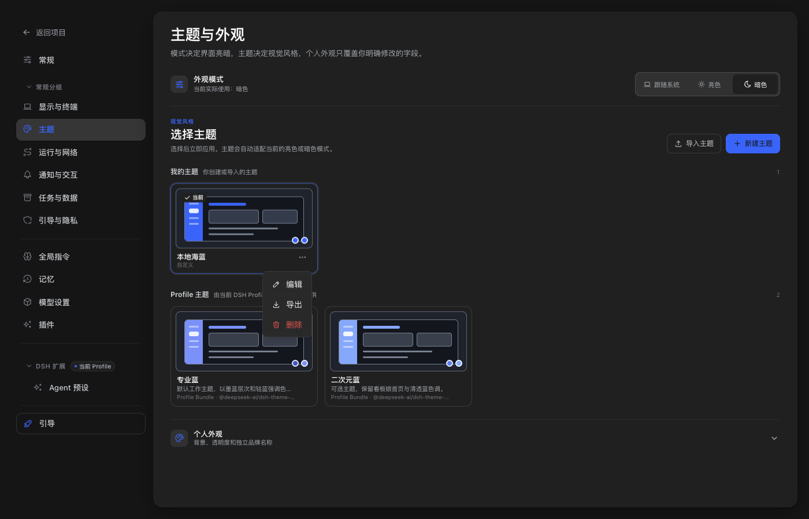
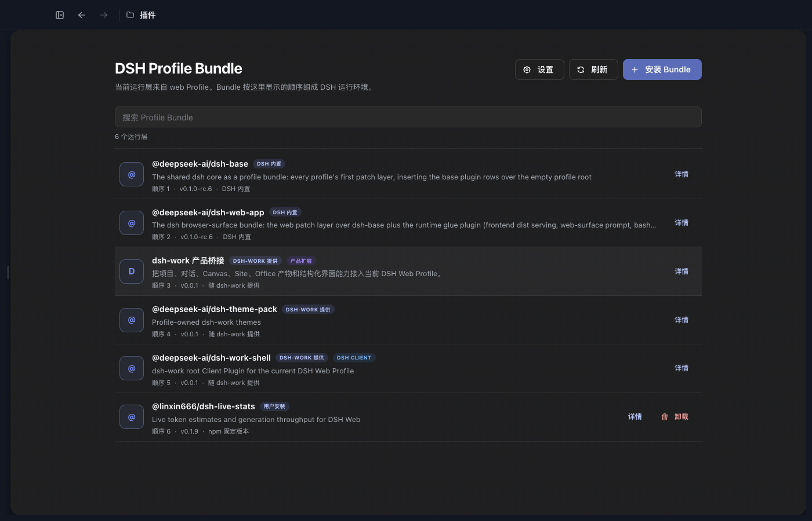

# DeepSeek Harness Desktop App

中文 | [English](README.en.md)

> [查看二次元版 README：二次元主题与看板娘](README.anime.md)

[](https://dshfind.com/zh/plugins/vibeinging/deepseek-harness-desktop-app?ref=badge)

DeepSeek Harness Desktop App 是建立在 DeepSeek Harness（DSH）之上的本地 AI 工作桌面。它把 DSH 的 Session、Agent、Tool、Skill、MCP 和 Profile Bundle 与项目、文件、网页、Git Worktree、Canvas、Site 和 Office 产物组织在同一个桌面应用中。

| 专业蓝亮色 | 专业蓝暗色 |
| --- | --- |
|  |  |

## 快速开始

本地开发要求 Node.js 24 或更高版本。当前项目使用 DSH `0.1.0-rc.6`。

```bash
npm install
npm run doctor
npm run dev
```

切换 Node.js 大版本、CPU 架构或操作系统后，运行 `npm run setup` 重新准备依赖。

## 主要功能

| 功能 | 用户可以做什么 |
|---|---|
| DSH 对话 | 流式回答、思考过程、工具调用、停止、继续、重试、消息分支和重启恢复 |
| 模型与权限 | 选择 Provider、模型和推理强度，管理凭据引用、Session 权限、工具审批和模型提问 |
| Tool、Skill、MCP 与多 Agent | 使用当前 Profile 中的工具、技能、MCP、Hook、子 Agent 和 Workflow |
| 项目与对话 | 创建项目、全局或临时对话，置顶、排序、重命名、归档、恢复和删除 |
| 桌面外壳与设置 | 使用三列工作台、左右栏折叠、全局搜索、缩放快捷键和更新检查，调整语言、网络、通知、终端与隐私选项 |
| 项目上下文与记忆 | 设置应用指令、项目指令、授权源码目录、写入目标以及全局或项目记忆 |
| 输入与引用 | 使用 `@` 引用文件、使用 `#` 引用对话，粘贴图片和大段文本附件 |
| 编码工作区 | 查看 Diff、逐行评论和编辑、在外部编辑器打开、发起 AI Review，并安全撤销模型产生的文件修改 |
| Git Worktree | 创建、启用、停用和删除隔离工作目录，让新对话在指定 Worktree 中运行 |
| 文件与搜索 | 浏览项目文件、任务和产物，预览文本、代码、图片和 Office 内容，按文件名或正文搜索 |
| Browser Workspace | 多标签浏览、历史、页内查找、缩放、下载、打印、开发者工具、站点权限、网页快照和“使用此页” |
| 结果与证据 | 直接查看当前 DSH Session 的完整轨迹、工具输入输出、耗时、Token 和最终回答 |
| Canvas 与本地 Site | 创建和编辑 Canvas、处理行内建议与版本冲突，生成并响应式预览单文件 Site |
| Office 产物 | 创建、查看和定点编辑 Markdown、DOCX、XLSX、PPTX 和 PDF，并保留版本 |
| 主题与外观 | 切换 Profile 主题，新建、导入、预览、编辑、导出和删除本地主题，调整明暗模式、背景和透明度 |
| 插件中心 | 检查兼容性，把 DSH Profile Bundle 安装到当前 Web Profile，并查看来源、版本和加载顺序 |

## DSH 轨迹就是结果与证据

右侧“结果与证据”直接读取当前绑定 DSH Session 的 `session.history`。用户消息、请求上下文、模型输出、工具调用、工具结果、权限变化和最终回答都在同一条可回放轨迹中，不维护第二套运行中心。



## 对话和工作台

一个项目对话对应一个 DSH Session。右侧工作台可以添加结果与证据、浏览器、文件、产物和 Site 标签；项目文件树、Agent 工作目录、当前 Diff 和行编辑都跟随当前项目权限与活动 Worktree。





Canvas 保存不可变版本，支持正文编辑、版本比较、精确行内建议和冲突处理。Site 使用同一套版本能力，并在隔离沙箱中提供桌面、平板和手机预览。





## Git Worktree 隔离开发

项目设置提供完整的 Worktree 工作流：

1. 为项目创建一个或多个独立分支和工作目录，同一时间启用一个。
2. 启用后，新建对话的 Agent、DSH Session、Diff 和行编辑使用该 Worktree，主检出保持不变。
3. 切换工作目录不会迁移已有对话；应先启用目标 Worktree，再新建对话。
4. 删除前必须切回主检出。删除工作目录后保留 Git 分支，避免误删提交。
5. 非 Git 目录、重复分支、越界路径和异常符号链接会被拒绝；磁盘上丢失的 Worktree 会标记为不可用。



## 主题与外观

`@deepseek-ai/dsh-theme-pack` Profile Bundle 提供默认的 `professional-blue` 和可选的 `anime-blue`。正式产品也支持本地自定义主题的新建、导入、预览、编辑、导出和删除。

本地主题只能使用安全的颜色与外观设置，不能注入原始 CSS、远程图片或修改应用名称。个人背景、明暗模式和透明度可以独立调整。



## 插件中心

普通用户从左侧“插件”页面安装 DSH Profile Bundle：

1. 输入带精确版本的 npm 包，或带完整 commit 的 `dsh-external` 仓库地址。
2. 先运行兼容性检查；只有结果为“可以安装”时才能写入当前 Profile。
3. 安装后查看 Bundle 的来源、版本、加载顺序和能力，用户安装的 Bundle 可以卸载。

Tool、Skill、MCP、Hook 等 Host Bundle 可以进入 DSH 运行时。包含第三方 Client UI 的 Bundle 目前不会进入拥有 Electron 权限的主窗口；随应用提供并经过审核的 Client Bundle 不受此限制。



## 与 DSH 官方 Web 的关系

DeepSeek Harness Desktop App 不是 DSH Web 的 iframe，也没有复制一套 Agent 运行时。Electron 启动 DSH Web Profile，并继续使用同一套 Session、Agent、Tool、Skill、MCP、Settings、Profile Bundle 和 Client Loader。DeepSeek Harness Desktop App 在同一运行链上提供自己的桌面外壳，并增加项目管理、文件授权、Browser Workspace、Git Worktree、Canvas、Site 和 Office 产物。

需要模型使用的产品能力通过绑定 Session 和 DSH Tool 接入；项目数据、文件权限、网页、Worktree 和产物版本仍由 DeepSeek Harness Desktop App 管理。

## 当前边界

- 当前没有五列任务看板、独立定时任务页面、Git 图谱、stage/unstage 面板或独立终端页。
- 本地 Site 只提供预览和单文件导出，没有部署服务；公开分享目前只有只读查看。
- 当前没有移动端远程控制、二维码配对、公网隧道、SSH、SFTP 或端口转发。
- 子 Agent 可以执行并出现在对话与轨迹中，但还没有完整的独立管理页。

## 数据与安全

Profile、Session、项目、运行记录和产物数据默认保存在本机 `~/.dsh`。项目源码目录默认只读，Agent 写入需要用户明确授权。

完整规则见 [PRIVACY.md](PRIVACY.md)、[SECURITY.md](SECURITY.md) 和 [THIRD_PARTY_NOTICES.md](THIRD_PARTY_NOTICES.md)。

## 平台状态

| 平台 | 当前状态 |
|---|---|
| macOS Apple Silicon | 开发与目录包已验证 |
| macOS Intel | Rosetta 检查通过，仍需 Intel 实机验收 |
| Windows x64 | 已接入构建流程，仍需安装包实机验收 |
| Windows arm64 | 暂不支持 |
| Linux | 暂无桌面打包配置 |

## 许可证

项目代码使用 [MIT License](LICENSE)。第三方依赖与二进制文件的来源、许可证和分发限制见 [THIRD_PARTY_NOTICES.md](THIRD_PARTY_NOTICES.md)。
