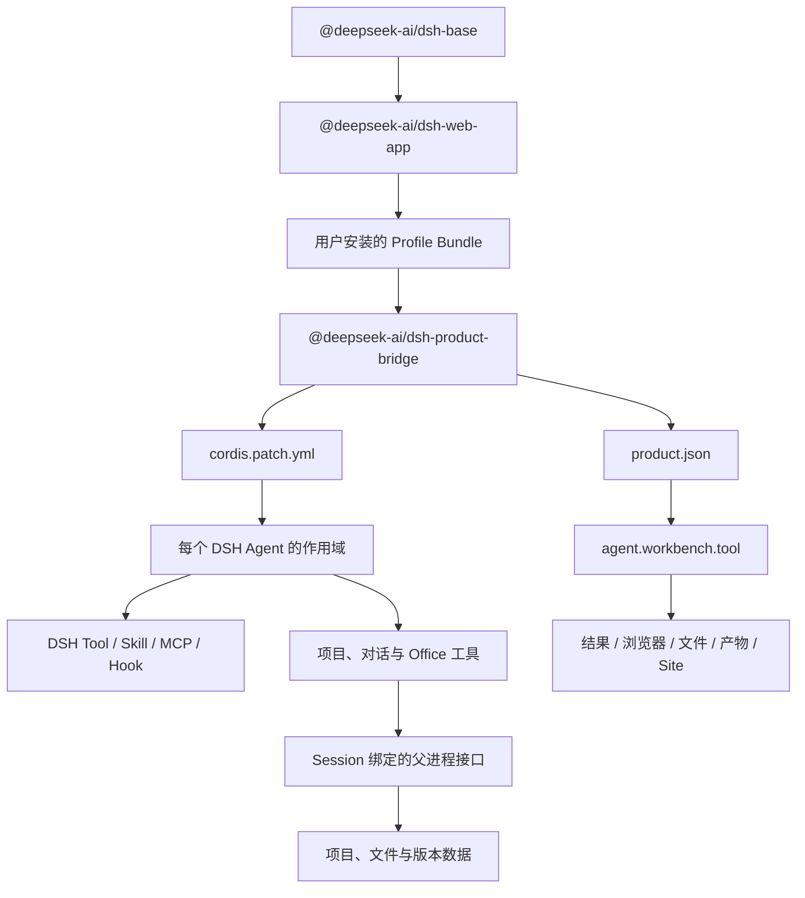
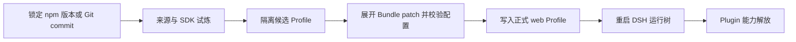

# dsh-work

> 拳打 WorkBuddy，脚踢 Codex。
>
> 和我们一起释放 Plugin 的力量，把每一个好点子变成影响世界的作品。

一个披着二次元外衣、认真把任务打穿的本地 AI 工作桌面。

dsh-work，让 DSH Plugin 在桌面真正觉醒。装上 Bundle，编好 Profile，项目、文件、网页和 Agent 一起开战。


_看板娘负责唤醒斗志，DSH Session 负责把任务一路打到终点。截图来自真实 Electron 窗口，不包含用户项目和会话数据。_

> 当前仍在内测修炼期。接口、Bundle 合同和安装方式可能继续进化，不代表已经公开发布。

## 战斗力清单

看板娘只是封面，真正启动后，每一层能力都要在 DSH 的正式运行树里亮起。

| 战场 | 可发动的能力 | 力量来源 |
|---|---|---|
| 会话战场 | 流式回答、计划、工具调用、队列、运行中补充、停止、恢复和历史记录 | DSH Session 与 Agent Plugin |
| 本地据点 | 项目、多个本地目录、文件浏览、预览、文件名搜索和正文搜索 | dsh-work 产品层 |
| 多 Agent 联合作战 | 把独立子任务交给子 Agent，并在主会话中汇总 | DSH Subagent 与 Workflow Plugin |
| Office 产物锻造 | 读取、创建和定点修改 Markdown、DOCX、XLSX、PPTX 与 PDF；每次保存形成新版本 | `dsh-product-bridge` |
| 右侧战术面板 | 结果与证据、浏览器、文件、产物和 Site 页面 | `agent.workbench.tool` 产品位置 |
| 能力扩展槽 | 通过 Profile Bundle、Skill、MCP、Hook 和 Web Slot 增加能力 | DSH Web Profile |
| 防护结界 | Session 绑定项目身份，写入操作走 DSH 审批，凭据不进入 Renderer 和 Bundle 配置 | DSH 权限层与 dsh-work 父进程 |


_不只是立绘和口号：真实项目会话会同时展开 Agent 回答、文件改动、工作区权限和模型选择。_

## 世界规则：一切皆 Plugin

DSH 官方的核心设定只有一句：**一切皆插件**。模型、工具、策略、存储、上下文管理和界面都可以成为 Cordis Plugin，连 Agent loop 也在这套体系中。

所以，真正释放能力的是 **Plugin**，不是 Profile：

- **Plugin 是招式**：它注册模型、工具、Skill、MCP、策略、存储或界面能力。
- **Bundle 是增援包**：它带着 `cordis.patch.yml`，把一组 Plugin 安装进 DSH。
- **Profile 是作战编成**：它把多个 Bundle patch 层按顺序叠放，决定这次启动到底带哪些能力。

dsh-work 不维护第二套插件宇宙。安装状态、加载顺序和运行状态都来自 DSH `web` Profile。



这条链有四个基本规则：

1. **Profile 是唯一权威**：Profile 的精确依赖表示已安装，`dsh.profile.bundles` 表示加载顺序。
2. **Bundle 是安装单位**：包必须声明 `package.json#dsh.bundle.patch`，由 patch 把 Plugin 加入 Cordis 运行树。
3. **能力进入正式接口**：模型能力进入 Tool、Skill、MCP、Hook 或 Cordis service；浏览器界面进入 DSH Web Slot。
4. **产品数据按 Session 授权**：Bundle 只发送 DSH Session id，dsh-work 父进程再解析当前用户、项目和权限。


_Plugin Center 就是编成界面：当前 `web` Profile 带了谁、谁先登场，一眼可见。_

## 专属召唤：dsh-work 产品桥

随应用提供的 [`@deepseek-ai/dsh-product-bridge`](packages/dsh-product-bridge/README.zh.md) 是 dsh-work 的专属 Bundle。它不篡改 Agent loop，也不越界读取产品数据库，只通过 DSH 的正式接口展开支援。

它同时展开两条支援线：

- `cordis.patch.yml` 把 `project_list`、`conversation_list` 和三个 `artifact_office_*` 工具注册到每个 Agent 的作用域。
- `product.json` 把结果、浏览器、文件、产物和 Site 页面放入 dsh-work 的 `agent.workbench.tool` 产品位置。

Office 创建和编辑属于高阶写入能力，会先触发 DSH 审批。编辑必须读取稳定锚点和当前版本；每次保存都会锻造一个不可变的新版本，旧版本不会在战斗中消失。


_产品桥的真名、顺序和能力都来自同一个 Profile，不存在藏在应用背后的第二份插件名单。_

## 新队友如何入队

一个新 Bundle 想加入队伍，不能只把仓库下载下来就宣布觉醒成功。普通用户从 Plugin Center 安装固定版本，还要通过候选 Profile、配置展开和真实启动三重试炼。



插件开发时可以用 DSH CLI 查看最终编成。Profile 是 pnpm workspace 根目录，因此召唤命令需要 `-w`：

```bash
# 固定 npm 版本
dsh plugin --profile web add -w @scope/dsh-example@1.2.3

# 固定 Git commit
dsh plugin --profile web add -w github:<owner>/<repo>#<40位commit>

# 启动前确认最终组合
dsh --profile web --dump-config
```

插件包的最小声明如下：

```json
{
  "name": "@deepseek-ai/dsh-example",
  "dsh": {
    "bundle": {
      "patch": "./cordis.patch.yml"
    }
  }
}
```

如果还要扩展 DSH 浏览器界面，使用嵌套的 `dsh.client` 清单和官方 Web Slot。如果要进入 dsh-work 的产品工作台，使用经过允许的 `dshWork.product` 描述；用户安装的 JSON 不能直接执行任意 Electron 组件。

## 召唤开发版

准备 Node.js 24 或更高版本，然后开始召唤开发版。当前开发版使用同级 DSH 源码运行时；Plugin 开发只使用官方 NPM SDK，不能让 TypeScript 配置偷连 DSH 源码。

```bash
cd /path/to/dsh-work

export DSH_RUNTIME_DISTRIBUTION=source
export DSH_SOURCE_ROOT=/absolute/path/to/dsh-source

npm install
npm run doctor
npm run dev
```

根目录命令会选择与本机原生依赖架构一致的 Node.js。切换 Node.js 大版本、CPU 架构或操作系统后，重新运行：

```bash
npm run setup
```

常用检查：

```bash
npm run typecheck
npm run test:renderer
npm run test:unit
npm run eval:pr
npm run eval:ui
```

最终试炼必须在真实 Electron 中完成。只打开 Renderer 地址，看见的只是投影，不能证明 IPC、DSH 子进程、系统权限和本地文件能力已经觉醒。

## 战斗编成

```text
dsh-work Renderer
  -> Electron IPC
  -> dsh-work server
  -> DSH RC2 Web Profile
  -> Cordis Plugin tree
  -> Session / Agent / Tool / Skill / MCP / Slot
```

| 目录 | 作用 |
|---|---|
| `electron/` | 桌面窗口、进程通信和打包 |
| `renderer/` | React 桌面界面 |
| `server/` | 项目数据、产品权限、DSH 进程管理和 Session 绑定 |
| `packages/` | 随应用提供的 DSH Profile Bundle |
| `eval/` | 单元测试、合同测试和真实 Electron 评测 |
| `docs/images/readme/` | README 使用的真实运行图和能力图 |

开发时 DSH Web 只监听 `127.0.0.1` 的本机端口。正式安装包使用进程通信，不把产品服务开放到局域网。

## 结界与禁区：数据安全

本地数据默认沉睡在 `~/.dsh`，包括项目、会话、运行记录、产物版本和本地 Trace。解除封印之前请先备份。

- 不要把 API Key、数据库密码、私有地址、真实业务数据或本地数据库提交到 Git。
- Source 目录默认只读；需要 Agent 修改文件时，应明确设置写入目录。
- Bundle 不能通过浏览器参数选择另一位用户、另一个项目或另一组凭据。
- 模型、MCP、OAuth 和远程服务仍受各自网络与账号边界限制。

更完整的规则见 [PRIVACY.md](PRIVACY.md)、[SECURITY.md](SECURITY.md) 和 [第三方组件说明](THIRD_PARTY_NOTICES.md)。

## 当前战况

当前版本仍在本地单机内测战线。DSH Session 主链、Profile 编成、产品桥、工作台贡献和核心 Electron 对话流程已经留下自动测试与真实桌面证据。外部 Bundle 仍要逐个完成 SDK 适配、候选安装、启动、卸载和残留检查；真实 OAuth、网站登录、长时间任务和不同模型能力也要在各自战场继续验收。

## 可出击平台

| 平台 | 当前状态 |
|---|---|
| macOS Apple Silicon | 开发和目录包已验证 |
| macOS Intel | 已通过 Rosetta 检查，仍需 Intel 实机验收 |
| Windows x64 | 已接入构建流程，仍需安装包实机验收 |
| Windows arm64 | 暂不支持 |
| Linux | 暂无桌面打包配置 |

未签名产物写入 `release/`。正式发布前还需要 macOS 签名与公证、Windows 代码签名、安装包实机检查和分发许可确认。

## 许可证

项目代码使用 [MIT License](LICENSE)。第三方依赖和二进制文件的许可证、来源与分发限制见 [THIRD_PARTY_NOTICES.md](THIRD_PARTY_NOTICES.md)。
